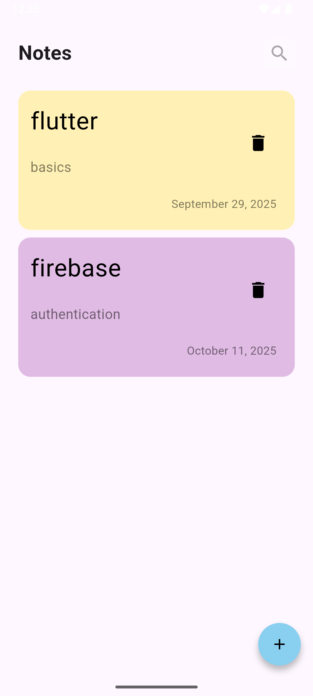
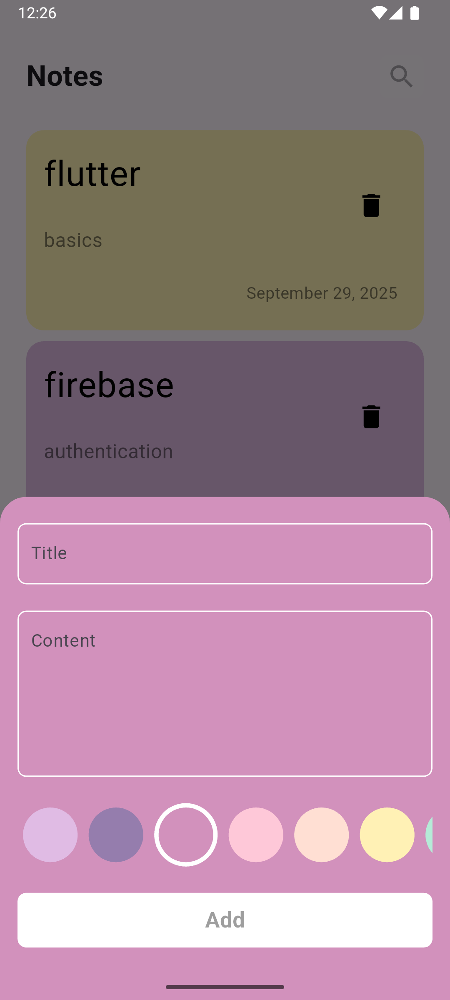
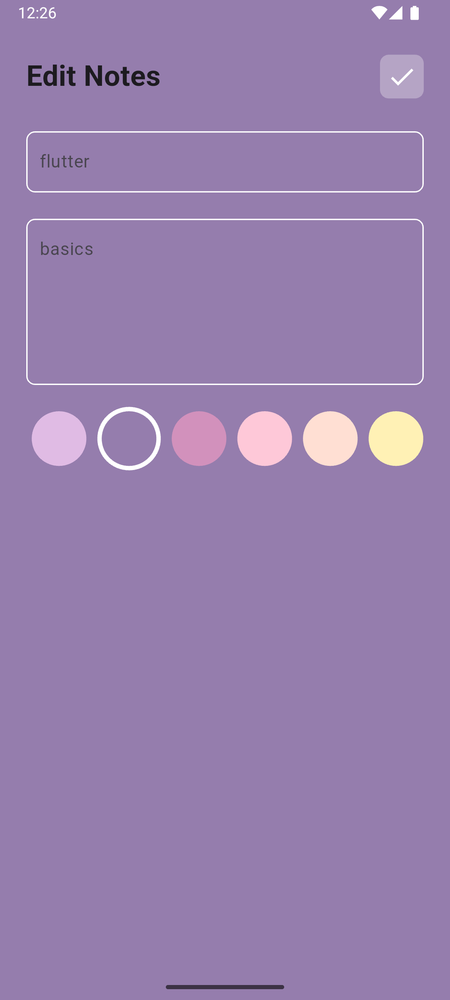

# 📝 Notes App

<p align="center">
  
</p>
A beautifully designed Flutter application that allows users to **create, edit, and organize their notes** effortlessly.  
The app features smooth animations, modern UI components, dynamic color selection, and persistent storage — making note-taking fast, elegant, and efficient.

---

## 🚀 Features

- ✨ **Add, Edit, and Delete Notes** – Manage your thoughts easily.  
- 🎨 **Dynamic Color Selection** – Choose your favorite color for each note.  
- 💾 **Local Persistence** – Notes are saved using Hive for offline storage.  
- ⚡ **Reactive UI** – Real-time updates with Flutter Bloc state management.  
- 💻 **Responsive Layout** – Optimized for all screen sizes.  
- 🧠 **Clean Architecture** – Organized, scalable, and maintainable code.

---

## 🧩 Technologies Used

| Category | Tools |
|-----------|--------|
| Framework | [Flutter](https://flutter.dev/) |
| State Management | [Bloc](https://pub.dev/packages/flutter_bloc) |
| Database | [Hive](https://pub.dev/packages/hive) |
| Date Formatting | [intl](https://pub.dev/packages/intl) |
| UI Components | Material Design, Custom Widgets |

---

---

## 📱 Screenshots

Below are some preview screens of the **Notes App** interface 👇  

| 📝 Add Note | 📋 Notes List | ✏️ Edit Note |
|--------------|---------------|---------------|
|  |  |  |

---

## ⚙️ Installation

Follow these steps to set up and run the project locally:

```bash
# Clone the repository
git clone https://github.com/your-username/notes-app.git

# Navigate to the project directory
cd notes-app

# Get dependencies
flutter pub get

# Run the app
flutter run
```
---
## 💡 Project Highlights

- 🗂️ Demonstrates how to **store data locally using Hive**, making it a great resource for learning local persistence in Flutter.
- 🧠 Uses **Bloc pattern** for clean and reactive state management.  
- 🎨 Includes a **custom color picker** that dynamically updates the UI theme.  
- ✨ Features **smooth animations** and polished UI transitions.  
- 🧩 Designed with **scalability and readability** in mind.

---
## 📚 Learnings

This project is a great resource to learn about:

- 🐝 **Local storage using Hive** for offline data management.  
- 🧩 **Bloc & Cubit** for effective state management in Flutter.  
- 🎨 **Custom UI components** and how to handle dynamic color updates.  
- 💾 **Data persistence**, validation, and model-driven architecture.  

---

## 🎯 Future Improvements

- 🔍 **Search and Filter Notes**  
  Add functionality to quickly find notes by title, content, or color.

- 🔔 **Notifications for Reminders**  
  Let users set reminders for important notes with local notifications.

---

## 🧑‍💻 Author

**Yomna Abdelmegeed**  
📧 yomna.developer@gmail.com  
🌐 [LinkedIn Profile](https://www.linkedin.com/in/yomna-abdelmegeed-91759026a/)


